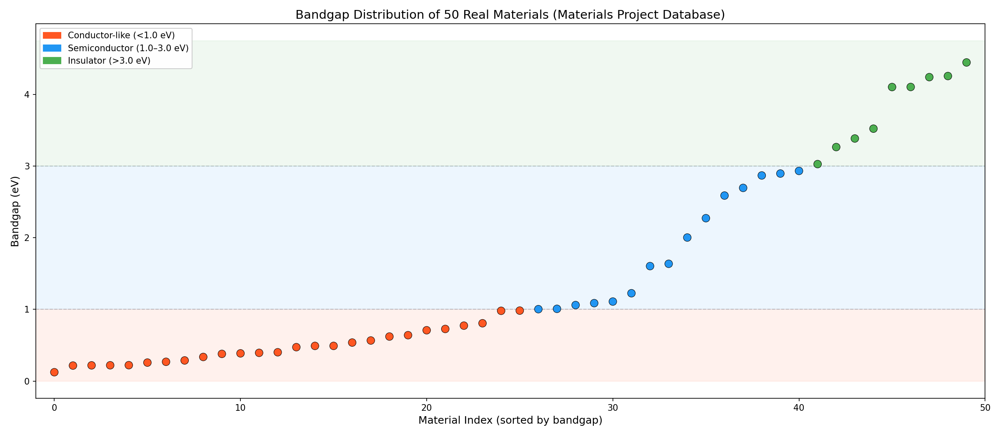
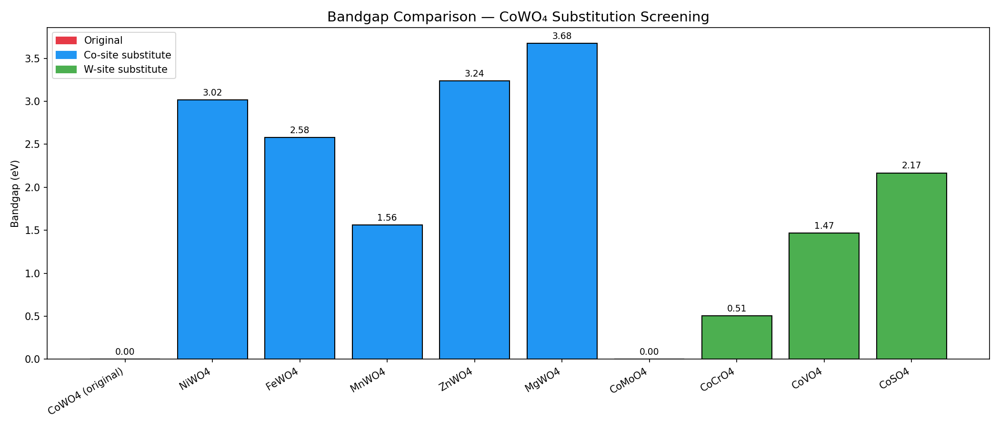
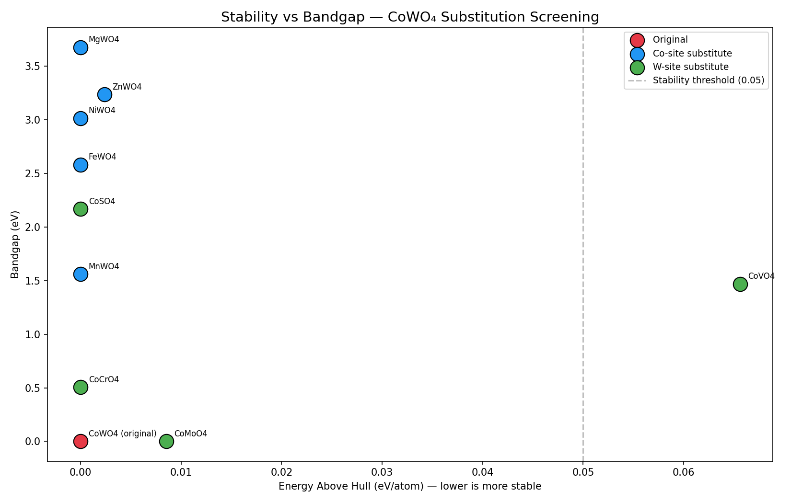

# 🔬 Materials Bandgap Analysis & ML Predictor

A data science project analyzing material bandgap properties and predicting 
real-world applications using machine learning — built by a Physics graduate 
applying lab research skills to Python and AI.

**Author:** John Valan Tony A | M.Sc Physics, Loyola College, Chennai

---

## 🚀 Live Demo

**[Try the Materials Application Predictor →](https://johnvalantony-materials-application-predictor.hf.space)**

Move the slider to input a bandgap value (eV) and instantly see the ML 
model's predicted application — Solar cells, LEDs, Photocatalysis, Batteries, 
Phosphors, or Gas sensors.

---

## 📋 About This Project

During my M.Sc Physics, I worked on synthesizing and characterizing Cobalt 
Tungstate using XRD, FTIR, UV-Vis, and SEM techniques. This project takes 
that materials science foundation and combines it with Python, data 
analysis, and machine learning to predict material applications from 
bandgap values.

---

## 📊 Analysis & Visualizations

### 1. Bandgap Comparison Across 10 Materials

Compared bandgap values of 10 key materials, color-coded by type 
(Semiconductor vs Insulator). Average bandgap: 2.69 eV.

### 2. Material Applications by Bandgap Range

Mapped which bandgap ranges correspond to which real-world applications — 
materials below 2.0 eV suit solar cells/batteries, while materials above 
3.0 eV suit LEDs/phosphors.

### 3. Machine Learning Prediction Zones

Trained a Decision Tree Classifier on the dataset to automatically identify 
bandgap "zones" for each application — without being told the rules manually.

---

## 🛠️ Tools & Technologies

- **Python** — core programming language
- **Pandas** — data manipulation and analysis
- **Matplotlib** — data visualization
- **Scikit-learn** — machine learning (Decision Tree Classifier)
- **Gradio** — interactive web app interface
- **Hugging Face Spaces** — live model deployment
- **Google Colab** — development environment

---

## 📁 Repository Contents

| File | Description |
|---|---|
| `bandgap_analysis.ipynb` | Initial 4-material analysis |
| `bandgap_analysis_v2.png` | 10-material comparison chart |
| `bandgap_vs_application.ipynb` | Scatter plot analysis notebook |
| `ml_prediction_zones.ipynb` | ML model training and visualization |
| `app.py` | Gradio web app source code |
| `requirements.txt` | Python dependencies |

---

## 💡 What I Learned

This project taught me how to take real scientific data and apply 
programming and machine learning to extract patterns and build a usable 
tool — bridging my background in experimental physics with practical 
data science skills.

## Model Note
The classifier achieves 100% accuracy because the categories are 
threshold-defined directly from bandgap value. This confirms the 
model correctly learned the rule, but real-world prediction tasks 
(e.g. predicting *application* from *structure*, not from bandgap 
itself) would be more meaningful next steps.

## Chart 4 — Real Materials Database Analysis

Connected to the Materials Project API (materialsproject.org) to pull 
real computed bandgap data for 50 materials, replacing the earlier 
hand-typed dataset.

### Key Finding
Trained a classifier to predict whether a material behaves as a metal, 
based purely on its bandgap value. Initial attempt gave a misleading 
100% accuracy because the sample only contained non-metals (bandgap > 0). 
After re-querying to include true metals (bandgap = 0), the model still 
achieved 100% — but this time the result is physically meaningful: a 
bandgap of exactly 0 eV is, by definition, characteristic of metallic 
behavior. The small test set (1 non-metal sample) means this result 
should be validated on a larger, more balanced dataset before drawing 
strong conclusions.

**Tools added:** `mp-api` (Materials Project API client)

## Project 2 — CoWO₄ Substitution Screening

Applied systematic element substitution to my own M.Sc thesis material 
(Cobalt Tungstate, CoWO₄) to explore how changing the metal cation 
affects electronic and thermodynamic properties — a simplified version 
of real materials discovery screening.

### Method
1. Verified CoWO₄ exists in the Materials Project database (2 polymorphs found; 
   the most stable, mp-19092, has Energy Above Hull = 0 eV/atom)
2. Substituted Cobalt with 5 chemically similar transition/alkaline earth 
   metals (Ni, Fe, Mn, Zn, Mg) and queried the database for each resulting formula
3. Substituted Tungsten with 5 alternatives (Mo, Cr, V, Ti, S) and repeated the search
4. Compared bandgap, stability (energy above hull), and formation energy across all 11 compounds

### Key Findings
- **CoWO₄ and CoMoO₄ are both metals (0 eV bandgap)** — Cobalt paired with 
  either Tungsten or Molybdenum produces metallic behavior, while every 
  other substitution opens a real bandgap (0.51–3.68 eV)
- **CoTiO₄ does not exist in the database** — a genuine gap, flagged as a 
  candidate for future DFT calculation or experimental study rather than 
  a confirmed novel material
- **CoVO₄ is the least stable candidate** (Energy Above Hull = 0.066 eV/atom), 
  despite a usable bandgap (1.47 eV) — worth deprioritizing experimentally 
  compared to the other stable candidates
- **MgWO₄ has both the widest bandgap (3.68 eV) and most favorable formation 
  energy (-2.56 eV/atom)** among all substitutes tested — the most promising 
  candidate for wide-bandgap applications if pursuing this substitution family

**Tools used:** Materials Project API formula search, pandas, matplotlib

## Project 3 — Materials Stability Prediction: A Systematic ML Investigation

Investigated which factors actually improve prediction of material stability 
(thermodynamic stability, defined as Energy Above Hull ≤ 0.05 eV/atom), 
testing three independent hypotheses on the same problem, one variable at a time.

### Setup
- **Data:** Up to 30,000 real materials from the Materials Project API
- **Features:** Structural properties (density, volume, bandgap, formation energy) 
  combined with 132 composition-derived "Magpie" chemistry features 
  (via `matminer`) — average electronegativity, melting point statistics, 
  valence electron counts, etc., computed purely from chemical formula
- **Target:** Binary stability classification
- **Evaluation:** 5-fold cross-validation (not single-split accuracy) for 
  reliable, trustworthy comparisons

### Data integrity check
An early version of this pipeline merged datasets on chemical formula, which 
silently inflated 3,000 materials into 18,522 rows due to duplicate formulas 
(polymorphs — the same formula can have multiple stable structures, as seen 
directly in this project's earlier CoWO₄ case study). This was caught by 
sanity-checking row counts after merging, and fixed by merging on the unique 
Material ID instead.

### Three experiments, one variable at a time

| Experiment | Change | Cross-Val Accuracy | Conclusion |
|---|---|---|---|
| Baseline | 3,000 materials, Random Forest | 73.2% (±3.17%) | — |
| 1. More data | 30,000 materials, Random Forest | 72.0% (±2.98%) | No improvement — data quantity was not the bottleneck |
| 2. Better algorithm | 30,000 materials, XGBoost | 75.7% (±4.25%) | Real improvement (+3.7pp) — algorithm choice mattered |
| 3. Feature selection | Top 60 of 137 features, XGBoost | 76.3% (±3.81%) | Small further gain, with lower variance |

(https://github.com/johnvalantony/Materials-data-analysis/blob/main/ml_investigation_journey.png)

### Key Findings
- **Scaling data 10x did not improve performance** — the model had already 
  learned what it could learn from these features at 3,000 samples
- **Switching from Random Forest to XGBoost gave the largest single gain**, 
  confirming the bottleneck was partly algorithmic, not data volume
- **The single most important feature was minimum melting point** of 
  constituent elements — a physically interpretable result, since melting 
  point reflects bond strength, which directly relates to structural stability
- **Bottom 50 of 137 features contributed only 11% of total model importance** 
  combined — removing them slightly improved both accuracy and reliability

This investigation reflects how real ML model development works: testing 
hypotheses systematically, validating data integrity, and reporting honest, 
reproducible comparisons rather than a single optimized number.

**Tools added:** `matminer` (Magpie composition featurization), `xgboost`
