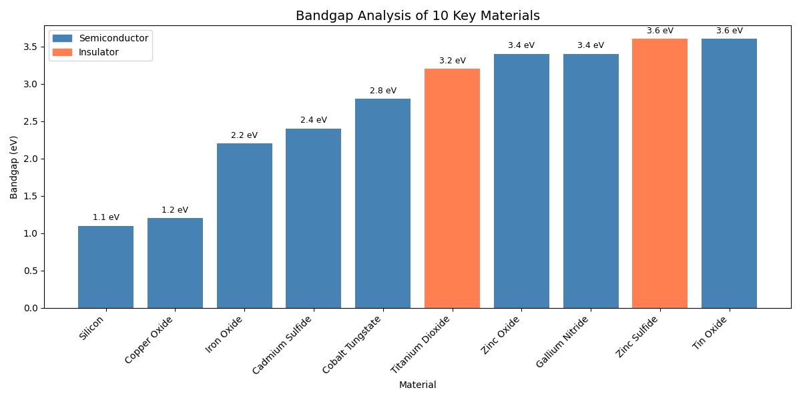
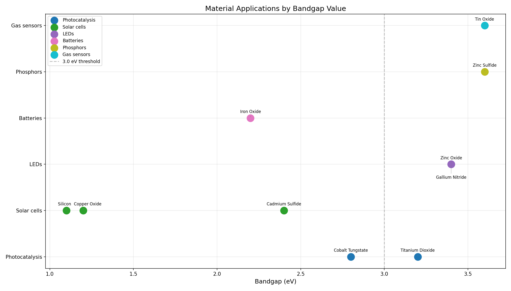
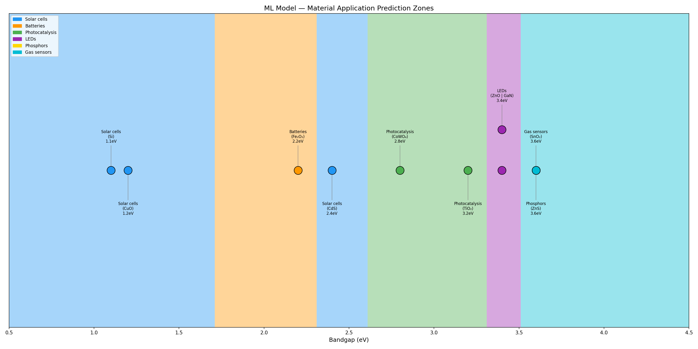

# 🔬 Materials Bandgap Analysis & ML Predictor

A data science project analyzing material bandgap properties and predicting 
real-world applications using machine learning — built by a Physics graduate 
applying lab research skills to Python and AI.

**Author:** John Valan Tony A | M.Sc Physics, Loyola College, Chennai

---

## 🚀 Live Demo

**[Try the Materials Application Predictor →](https://johnvalantony-materials-application-predictor.hf.space)**

Move the slider to input a bandgap value (eV) and instantly see the ML 
model's predicted application — Solar cells, LEDs, Photocatalysis, Batteries, 
Phosphors, or Gas sensors.

---

## 📋 About This Project

During my M.Sc Physics, I worked on synthesizing and characterizing Cobalt 
Tungstate using XRD, FTIR, UV-Vis, and SEM techniques. This project takes 
that materials science foundation and combines it with Python, data 
analysis, and machine learning to predict material applications from 
bandgap values.

---

## 📊 Analysis & Visualizations

### 1. Bandgap Comparison Across 10 Materials

Compared bandgap values of 10 key materials, color-coded by type 
(Semiconductor vs Insulator). Average bandgap: 2.69 eV.

### 2. Material Applications by Bandgap Range

Mapped which bandgap ranges correspond to which real-world applications — 
materials below 2.0 eV suit solar cells/batteries, while materials above 
3.0 eV suit LEDs/phosphors.

### 3. Machine Learning Prediction Zones

Trained a Decision Tree Classifier on the dataset to automatically identify 
bandgap "zones" for each application — without being told the rules manually.

---

## 🛠️ Tools & Technologies

- **Python** — core programming language
- **Pandas** — data manipulation and analysis
- **Matplotlib** — data visualization
- **Scikit-learn** — machine learning (Decision Tree Classifier)
- **Gradio** — interactive web app interface
- **Hugging Face Spaces** — live model deployment
- **Google Colab** — development environment

---

## 📁 Repository Contents

| File | Description |
|---|---|
| `bandgap_analysis.ipynb` | Initial 4-material analysis |
| `bandgap_analysis_v2.png` | 10-material comparison chart |
| `bandgap_vs_application.ipynb` | Scatter plot analysis notebook |
| `ml_prediction_zones.ipynb` | ML model training and visualization |
| `app.py` | Gradio web app source code |
| `requirements.txt` | Python dependencies |

---

## 💡 What I Learned

This project taught me how to take real scientific data and apply 
programming and machine learning to extract patterns and build a usable 
tool — bridging my background in experimental physics with practical 
data science skills.
